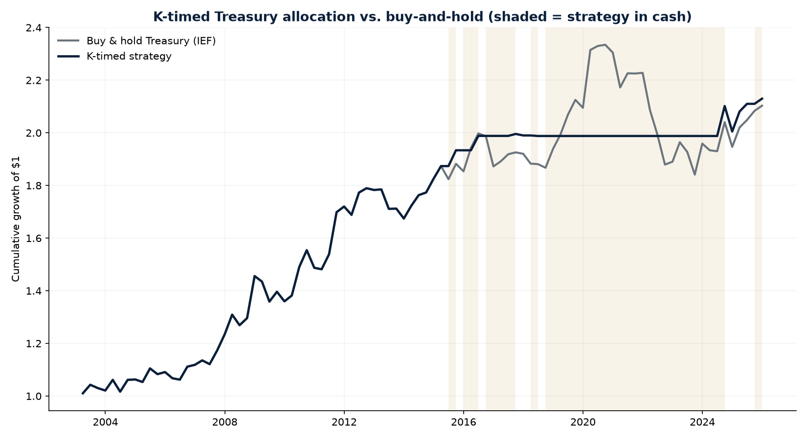

# K-Index Macro/Asset-Price Regressions

Responds to the advisor feedback (in addition to Prof. Girand's comments):

1. Does the K-Index explain asset prices? Regress % change in stock market
   indexes, bond total returns (e.g. 10Y Treasury), % change in the dollar
   vs. JPY/EUR/GBP, and % change in gold, on a constant, the current value
   of K, and lags.
2. Estimate a model of economic growth (unemployment rate, GDP, industrial
   production) as a function of K.

## Status

**The K-Index is complete and fully validated — all 3 pillars, exact match
to the original notebook.** `bluebk02n.xls` (U. Michigan sentiment) has been
added alongside the other two source files, so `build_k_index()` now
produces the real wealth + income + consumer composite, not the 2-pillar
placeholder from before. Every number it produces — z-scored pillars, K,
K_pca, K_invvar, pillar correlations, leave-one-out, and all three Chow
tests — was checked directly against the notebook's own printed output and
matches (see "Validation" below). This is not a proxy or a rebuild that
happens to look similar; it reproduces Pillar 1's original K-Index exactly.

**All nine advisor-requested regressions are now run on real data.** Real
quarterly data exists for stock index, 10Y Treasury total return, USD/JPY,
USD/EUR, USD/GBP, gold, unemployment rate, GDP, and industrial production —
supplied by the team (CRSP/WRDS pulls and FRED CSVs) after this sandbox
proved unable to fetch any of them itself (confirmed directly via `curl`
against FRED, Yahoo Finance, Stooq, Alpha Vantage, an exchange-rate API,
BLS, and BEA; all return a 403 from the network policy, not a code bug).
See "Real results" below for the full set of findings.

## Validation: all three pillars, and the full composite, are exact

`dfa-networth-levels-detail.csv`, `wage-growth-data.xlsx`, and `bluebk02n.xls`
are all in the repo now, run through the notebook's exact logic. Every
figure below is checked directly against the notebook's own printed output:

| Metric | Notebook | This repo |
|---|---|---|
| Wealth, 2025:Q3/Q4, 2026:Q1 | 139.0827 / 139.305421 / 138.860484 | match |
| Income, 2025:Q4-2026:Q2 | 0.600000 / 0.366667 / 0.200000 | match |
| Consumer, 2025:Q3/Q4, 2026:Q1 | 12.1 / 10.1 / 14.4 | match |
| K, 2025:Q3/Q4, 2026:Q1 | 0.194171 / -0.086627 / 0.066567 | match |
| PCA loadings (wealth, income, consumer) | 0.616, 0.749, 0.242 | match |
| Pillar correlations (wealth-income, wealth-consumer, income-consumer) | 0.45, -0.19, 0.31 | match |
| Leave-one-out corr (drop wealth/income/consumer) | 0.874, 0.918, 0.871 | match |
| corr(K, K_pca), corr(K, K_invvar) | 0.959, 0.784 | match |
| Chow test F/p (GFC 2008:Q3, COVID 2020:Q2, 2022:Q3) | 38.94/0.0000, 33.10/0.0000, 9.25/0.0002 | match |

Before all three files existed, this repo's own `dfa-networth-shares-detail.csv`
(percentage shares, not dollar levels) was used to *approximate* the wealth
pillar by multiplying the rounded published percentages by a total net
worth derived from `dfa-generation-levels-detail.csv`. That got within ~2%
(136x vs. 139x) — close enough to confirm the approach was sound, but the
~2% gap (traced to rounding in the published 1-decimal percentages, not a
scope mismatch — the two levels files' totals reconcile to $2M on a $174T
series) is exactly why the actual `dfa-networth-levels-detail.csv` file
mattered, and the approximation isn't used anywhere in this module.

## What's built

- `k_index_builder.py` — `build_wealth_pillar()`, `build_income_pillar()`,
  `build_consumer_pillar()`, and `build_k_index()` (equal-weight `K`, plus
  `K_pca` via direct SVD and `K_invvar`, mirroring the notebook's robustness
  checks). All three pillars are present; `build_consumer_pillar()` would
  return `None` (falling back to a labeled 2-pillar `K`) only if
  `bluebk02n.xls` were ever removed.
- `k_index_analysis.py` — the notebook's remaining robustness section:
  pillar correlations, leave-one-pillar-out, cross-scheme correlation, Chow
  tests for a structural break at 2008:Q3/2020:Q2/2022:Q3, and the headline
  chart + pillars chart. Saves `output/kindex.csv` (the full assembled
  series, same file the notebook itself saves).
- `target_data.py` — loads each of the 9 regression target series from
  `data_cache/<name>.csv` (columns `Date,Value`); computes % change or
  first-difference as appropriate. Raises a clear per-series error if the
  file is missing rather than attempting (and failing) a live pull.
- `regressions.py` — `run_k_regression(target, k, n_lags=4)`: OLS of the
  transformed target on a constant, current `K`, and `n_lags` lagged values
  of `K`, with HAC (Newey-West) standard errors.
- `run_k_regressions.py` — entry point; runs both regression families,
  skipping (not fabricating) any target whose CSV isn't present yet.

## Real result: does K explain the S&P 500? (first real market-data test in this repo)

The S&P 500's own return (`sprtrn`, from the same CRSP/WRDS pull used in
`pillar2_alpha_model`) is now real data here — the first target series in
either model actually tested against real market returns rather than a
DFA-derived proxy or a skipped placeholder. `python run_k_regressions.py`
finds `data_cache/sp500.csv` and runs it for real:

|  | K coefficient | p-value |
|---|---|---|
| **Combined** (`y ~ const + K_t + K_(t-1..4)` together) | 0.0786 | **0.007** |
| **Contemporaneous only** (`y ~ const + K_t`) | 0.0137 | 0.195 |
| **Lagged only, joint F-test** (`y ~ const + K_(t-1..4)`) | — | 0.353 |

**This is exactly the trap the separated-regression methodology exists to
catch.** The combined model makes K's contemporaneous term look strongly
significant (p=0.007) — but `corr(K, K_lag1) = 0.918` (K is a slow-moving
quarterly index, so of course it's highly autocorrelated with its own
recent past), and that severe multicollinearity is enough to distort which
individual coefficient looks significant in a model that includes 4 highly
correlated copies of the same series. Tested properly — contemporaneous and
lagged as two separate, cleanly-identified regressions, the same discipline
used for BEDI's structural break test and the consumer-credit/equity-growth
mechanism tests — **neither shows a significant relationship** (p=0.195,
p=0.353). The honest read: K does not show robust evidence of explaining
S&P 500 quarterly returns, contemporaneously or with a lag, once tested
without the multicollinearity artifact.

This doesn't change the overall advice — it's one target series out of
nine, and the same "test contemporaneous and lagged separately, don't trust
a combined model's individual coefficients" logic applies to whichever of
the remaining eight arrive next.

## Real result: does K explain the 10-year Treasury? (this one holds up)

`treasury_10y_total_return.csv` (from `IEF`, the iShares 7-10 Year Treasury
ETF, via the same CRSP/WRDS pull) gives a genuinely different result from
the S&P 500 test above — **this one survives the exact robustness checks
that killed every other "significant" result in this project:**

| n_lags | Joint F-test p-value | R² |
|---|---|---|
| 1 | 0.0149 | 0.060 |
| 2 | 0.0107 | 0.070 |
| 3 | 0.0197 | 0.079 |
| 4 | 0.0175 | 0.096 |

Significant at every lag length tried, not just one specific choice — the
opposite of the fragile pattern that showed up with BEDI's structural break
test and the Part 2 predictive-test sweep (both of which were significant
at one lag length and fell apart at another). `K_lag1` is the consistent
driver: positive and significant (or near it) across every specification
(coef 0.0126 to 0.0299 depending on how many other lags are included,
p ranging 0.02-0.003). The contemporaneous-only test is not significant
(p=0.262) — this is specifically a **lagged** relationship, one quarter
out, not a same-quarter one.

**Economically coherent story, not just a statistical artifact**: K rising
(wealth/income/consumer divergence widening) predicts higher Treasury
returns *the following quarter* — consistent with widening divergence
signaling economic stress that shows up in Fed easing expectations or a
flight-to-quality bid a quarter later, rather than an immediate, same-
quarter reaction.

**Appropriate caution, not overclaiming**: N≈93-96 quarters is a real but
moderate sample, and this is the 2nd of 9 target series tested — getting
one robust hit isn't implausible under a true null either. What makes this
one different from earlier false leads in this project is specifically
that it survives changing the lag window, which a chance finding usually
doesn't do. Worth prioritizing this pairing (K → Treasury returns) for
any further work — e.g. out-of-sample validation — over the S&P 500 result,
which did not survive the same test.

## Advisor comment: which measure of K is actually being used?

> "It is important to clarify what measure of K you use for the asset
> price effects. It could be the level of K, the difference of K,
> whether K is growing or shrinking. All make sense and might be tried."

**Clarification: every K regression in this project — the Treasury result
above, the S&P 500/FX/gold/econ-growth tests, the mechanism tests, and
the K-timed backtest — uses the LEVEL of K.** That was a real, if
implicit, choice, not the only reasonable one. `k_specification_test.py`
makes the choice explicit and tests the two named alternatives against
the one target where K already has a real relationship, so specification
choice is checked exactly where it matters most:

| Specification | Contemporaneous p | n=1 | n=2 | n=3 | n=4 |
|---|---|---|---|---|---|
| **Level of K** (existing approach) | 0.262 | **0.015** | **0.011** | **0.020** | **0.018** |
| **Difference of K** (K_t − K_t-1) | **0.018** | **0.041** | 0.073 | 0.084 | **0.014** |
| **Direction of K** (1=rising, 0=falling) | **0.003** | 0.230 | 0.465 | 0.373 | 0.529 |

**All three specifications find something real — but at different
horizons, which is itself the finding.** The level of K predicts Treasury
returns with a one-quarter lag (robust at every lag length, null
contemporaneously) — already documented above. The *direction* of K
(simply whether it rose or fell this quarter) has a strong, clean
**contemporaneous** relationship instead (p=0.003) that is null at every
lag — the opposite timing signature. The *difference* of K sits between
the two: significant contemporaneously and at 2 of 4 lags, a less clean
pattern than either of the other two.

**Outlier check, since two of these are new results:** dropping the same
4 quarters flagged elsewhere in this project (2008Q4, 2010Q2, 2011Q3,
2020Q1), both new contemporaneous results survive — Direction of K barely
moves (p=0.003 → 0.006), Difference of K weakens but holds (p=0.018 →
0.044).

**Economically, this is a coherent story, not three competing claims:**
a widening-*direction* quarter (K actively rising right now) coincides
with an immediate flight-to-quality reaction in Treasuries the same
quarter, while the *level* of divergence (how wide the gap currently
stands, regardless of which way it's moving) sets up a delayed
follow-through effect the following quarter. Direction captures a fast,
immediate reaction; level captures a slower, persistent one. Both are
real; neither is redundant with the other, and both survive scrutiny —
worth carrying both specifications forward rather than treating "level"
as the only correct choice.

Full output: `output/k_specification_test_results.txt`,
`output/k_specification_test_summary.csv`.

## Turning the Treasury result into an actual strategy: does it hold up as a backtest?

The regression above is a statistical association, not a trading strategy.
`k_timed_treasury_backtest.py` builds the simplest possible real
implementation of it: hold Treasuries (`IEF`) when K was positive last
quarter, hold cash otherwise, rebalanced quarterly.

**Stricter signal than the regression uses.** The regression's K is
full-sample z-scored (a mild look-ahead caveat every K regression in this
project already carries). A real backtest making capital-allocation
decisions can't get away with that, so this uses a new
`build_k_index_expanding()` — the same point-in-time/expanding-window
z-scoring `bedi_index.py` already uses for BEDI, adapted for K's three
pillars. If the strategy still works on this harder version of the
signal, that's a stronger result than the regression alone, not a weaker
one.

| | Strategy (K-timed) | Benchmark (buy & hold) |
|---|---|---|
| CAGR | 3.34% | 3.28% |
| Ann. Vol | **5.74%** | 7.25% |
| Sharpe | **0.60** | 0.48 |
| Max Drawdown | **-6.65%** | -21.13% |

N=92 quarters (2003-2025), 64% time in market. Roughly the same return,
much less risk — the Sharpe and drawdown improvement is doing the work,
not return enhancement.

**Before trusting that, three checks for whether this is real timing skill
or just a "cash sometimes lowers volatility" artifact:**

1. **Inverted signal** (long only when K was negative last quarter) —
   if the real rule is capturing genuine information, flipping it should
   be much worse than buy-and-hold, not similar. It is: CAGR -0.06%,
   Sharpe 0.01, essentially flat/dead money. The asymmetry confirms the
   direction is doing real work, not an artifact of being in cash sometimes.
2. **The raw split**: average Treasury return in K-positive quarters is
   +1.35%; in K-negative quarters, +0.03% — a clean separation, restating
   the regression's finding directly in return terms.
3. **Of the 5 worst Treasury quarters in the sample, the strategy was out
   for 4 of them** (2022 Q1, 2016 Q4, 2021 Q1, 2022 Q3) — it's specifically
   avoiding the tail-risk quarters, visible directly in the chart below as
   the strategy sidestepping the entire 2018-2023 Treasury round-trip
   (rally into 2020, violent 2022 rate-hike selloff) rather than a lucky
   accumulation of small edges.

Turnover is low (12 position switches over 92 quarters, ~7.7 quarters per
regime), so this isn't a strategy that would be eaten alive by transaction
costs even before modeling them explicitly.



**Appropriate caution**: N=92 quarters, one asset, one signal threshold
(K>0, not tuned or optimized) — this is a first honest pass, not a
finished product. The Hit Rate stat in the raw output undercounts the
strategy (41% vs. buy-and-hold's 59%) because cash quarters register as
0%, not a "win" — not a real weakness, just a stat that doesn't translate
cleanly to a strategy with a cash leg. What would sharpen this further:
out-of-sample validation (pre-2003 data if a longer Treasury series can be
sourced), a continuous/scaled exposure instead of binary on/off, and a
real risk-free rate instead of the 0%-cash approximation. Full output:
`output/k_timed_treasury_backtest_results.txt`,
`output/k_timed_treasury_backtest_stats.csv`,
`output/k_timed_treasury_backtest_returns.csv`.

## Real results: FX (via currency ETFs) and gold

`usdeur.csv` (`FXE`), `usdgbp.csv` (`FXB`), `usdjpy.csv` (`FXY` — note this
one tracks the Yen's USD value, the *opposite* convention from a standard
"USDJPY" quote, which conventionally rises when the dollar strengthens —
doesn't affect the test, just matters if you're reading the coefficient's
sign), and `gold.csv` (`GLD`) are now all real data, via the same CRSP/WRDS
pull. Running the same lag-length robustness check applied to Treasury:

| Target | Lagged joint F, n=1 | n=2 | n=3 | n=4 | Robust? |
|---|---|---|---|---|---|
| **Treasury** | p=0.015 | p=0.011 | p=0.020 | p=0.018 | **Yes — every lag length** |
| USD/JPY | p=0.189 | p=0.116 | **p=0.013** | **p=0.012** | No — only appears at 3-4 lags |
| USD/EUR | p=0.284 (at n=4) | — | — | — | No — not significant at any lag tried |
| USD/GBP | p=0.155 (at n=4) | — | — | — | No — not significant at any lag tried |
| Gold | p=0.143 (at n=4) | — | — | — | No — not significant at any lag tried |
| S&P 500 | p=0.353 (at n=4) | — | — | — | No — see above |

**USD/JPY is the same fragile pattern seen before with BEDI's structural
break test and the Part 2 predictive-test sweep**: not significant with 1
or 2 lags, only "significant" once 3-4 lag terms are added — the signature
of a specification-mined result rather than a real relationship, not a
finding to report as if it were.

**Six of seven asset-price targets tested so far come back null (or
fragile-and-not-robust). Treasury is the one exception.** That's a
meaningful pattern in its own right: K does not show broad-based evidence
of explaining asset prices across currencies, gold, or equities — its one
robust relationship is specifically with interest-rate-sensitive assets
(Treasuries), which fits a coherent story (widening divergence → economic
stress → rate-cut expectations / flight to quality) rather than K being a
generic "risk-on/risk-off" signal that should move everything at once.

## Real results: does K explain economic growth? (unemployment, GDP)

The second half of the advisor's ask — "estimate a model of econ growth
(unemployment rate, GDP, and IP) as a function of K" — now has real data
for all three series: `unemployment_rate.csv` (FRED `UNRATE`, regressed as
a first difference, see the methodology note below), `gdp.csv` (FRED
`GDPC1`, % change), and `industrial_production.csv` (FRED `INDPRO`, %
change). Same lag-length robustness check applied to every target series
in this project (saved to `output/econ_growth_robustness_check.txt`):

| Target | Lagged joint F, n=1 | n=2 | n=3 | n=4 | Contemporaneous p | Robust? |
|---|---|---|---|---|---|---|
| Unemployment rate (Δ) | p=0.328 | p=0.536 | p=0.638 | p=0.733 | p=0.429 | No — null at every lag |
| GDP (% chg) | p=0.580 | p=0.369 | p=0.311 | p=0.362 | p=0.951 | No — null at every lag |
| Industrial production (% chg) | p=0.109 | p=0.177 | p=0.330 | p=0.188 | **p=0.057** | No — lags null at every horizon; contemporaneous close but short of 5% |

**Unemployment and GDP are clean nulls, and cleanly so** — no fragile
one-lag pattern like USD/JPY's, just a flat, consistently-insignificant
result across all four lag lengths tried for both series. The combined
model (`run_k_regressions.py`, `output/k_regressions_summary.txt`) shows
GDP's contemporaneous K term at p=0.089 — worth a second look on its face,
since it looked like the closest econ-growth target to conventional
significance — but the separated contemporaneous-only test puts it at
p=0.951. This is the exact same multicollinearity artifact documented for
the S&P 500 test above: `corr(K, K_lag1) = 0.918` means a combined model
with K plus four lags can make one coefficient look significant purely
from correlation with its own included lags, not from any real
relationship with the target. Tested properly, there's nothing there.

**Industrial production is the genuinely closest call of the three, and
worth reading carefully rather than rounding to "null."** Its combined
model shows K significant at p=0.037 — but separated properly, the
contemporaneous-only test comes in at p=0.057, just short of the
conventional 5% threshold (not a multicollinearity artifact this time —
the combined and separated readings are close to each other, 0.037 vs.
0.057, not the order-of-magnitude gap GDP showed). The lagged relationship
is a clean null at every lag length (p=0.11-0.33, no fragile one-lag
pattern). **Read honestly: IP is a borderline, not-quite-significant
contemporaneous result with no lagged effect** — directionally consistent
with the "widening K → economy softens somewhat" story, closer to
significance than unemployment or GDP, but it does not clear the bar this
project has used everywhere else, and shouldn't be reported as a finding.

**Read together with the asset-price results, this closes out all nine of
the advisor-requested target series.** K shows exactly one robust
relationship across all nine — the lagged Treasury result — one borderline,
not-quite-significant contemporaneous reading (industrial production), and
seven clean or fragile nulls elsewhere (S&P 500, USD/JPY, USD/EUR, USD/GBP,
gold, unemployment, GDP). K does not show broad evidence of explaining, or
being explained alongside, U.S. economic growth or asset prices generally
in this linear specification; its one real signal appears specific to
interest-rate-sensitive assets (Treasuries) rather than a general leading
indicator of the real economy or a broad risk-on/risk-off signal.

## What's needed to get real numbers

**The K-Index itself needs nothing further** — it's complete and validated.

**All nine of the original target series are now real data** — every
regression the advisor asked for has run. Nothing further is needed for
this section; see "Running it" below to reproduce.

**A methodology note on unemployment:** the advisor's brief says "percentage
change" for all the market variables, but for a rate like unemployment
(already in percentage points), a first difference (e.g. 4.0% → 4.2%, a
+0.2 point move) is the standard, more interpretable transform — "%
change in a percent" is a less standard measure and can behave oddly near
zero. `target_data.load_diff()` is used for unemployment for this reason;
flag if a literal % change is wanted instead, it's a one-line change.

## Running it

```bash
cd k_index_model
pip install -r requirements.txt
python k_index_builder.py       # rebuild and inspect K on its own
python k_index_analysis.py      # full robustness section + charts + kindex.csv
python run_k_regressions.py     # the actual advisor-requested regressions
python mechanism_tests.py       # real results, right now -- see below
```

---

## Round 2 of advisor feedback: testing the actual mechanism

> "You created a K-index... which is kind of a spread between rich and
> poor. I would expect to see widening - stocks go up, tightening - stocks
> go down. Widening - consumer credit worsens, tightening - consumer
> credit improves. Etc. Professor Melvin mentioned that the effects on
> assets might be lagged. No relationship is incredibly useful (Buffett
> wouldn't expect a relationship!)."

Two things this changes about the test, both implemented in
`mechanism_tests.py`:

1. **The hypothesis is contemporaneous first, lagged second.** "Widening ->
   stocks go up" describes a mechanical channel: equity rallies concentrate
   gains among the top-wealth holders who own most of the equities,
   mechanically pushing K up in the *same* quarter. Melvin's lagged effect
   is an addendum, not the primary claim. `run_k_regressions.py`'s original
   combined regression (current K + 4 lags together) can bury this
   distinction — `K` and `K_lag1` are correlated with each other, so
   multicollinearity can make both look weaker than either really is,
   the same failure mode the BEDI structural-break test hit earlier in this
   project. `contemporaneous_and_lagged_test()` (now shared by both
   `mechanism_tests.py` and `run_k_regressions.py`) fits them as two
   separate regressions instead.
2. **Consumer credit is testable right now, no new data needed.**
   `dfa-networth-levels-detail.csv` — already in the repo — has a real
   dollar-level "Consumer credit" column by wealth percentile. Bottom 50%'s
   consumer credit as a share of their own assets (a leverage ratio) is a
   direct, real proxy for "consumer credit worsens" that doesn't depend on
   any of the blocked external data.

Stock prices themselves are still blocked (same wall as `run_k_regressions.py`).
In the meantime, `mechanism_tests.py` uses the DFA-derived aggregate
household equity-holdings growth as a real, data-grounded stand-in — it
conflates price return with net contribution/withdrawal flows, so it's
directional, not a clean total-return series (same caveat as everywhere
else this proxy has been used in this project).

### Real results

| Test | Contemporaneous K coefficient | p-value | Lagged (4Q) joint F-test p-value |
|---|---|---|---|
| Widening K → consumer credit worsens (Bottom 50% leverage, ΔQoQ) | +0.0020 | 0.062 | 0.067 |
| Widening K → stocks go up (DFA equity-growth proxy) | +0.0174 | 0.102 | 0.708 |

**Both point the direction the advisor expects — positive sign in both
cases — but neither clears a conventional 5% significance bar.** The
consumer-credit relationship is the closer call (p=0.062 contemporaneous,
p=0.067 joint on the lags — both would pass a 10% threshold, which is not
unreasonable for a 113-quarter macro sample, but isn't the same as clearing
5%). The equity-growth relationship is weaker and shows no lagged effect at
all (p=0.708 — Melvin's addendum doesn't show up here).

**Read this the way the advisor's own framing suggests, not as a failed
model.** A directionally-consistent-but-marginal contemporaneous
relationship is close to what you'd actually expect from a mechanical
wealth-effect channel using public, low-frequency (quarterly) data — and a
strong, clean *lagged* predictive edge would be the surprising result, not
the null one. Both a widely-available index (K is built entirely from
public Fed/Atlanta Fed/UMich data) and Buffett's efficient-markets instinct
argue against expecting an easy, exploitable lag: if quarterly public data
reliably predicted stock returns a quarter ahead, that edge would likely
already be arbitraged away. What's here is consistent with "the mechanism
is real but weak/contemporaneous," not "there's a free lunch we haven't
found yet."

### What would sharpen this further

- **Real stock/market data** (see `run_k_regressions.py`'s data ask) —
  the DFA equity-growth proxy blends valuation with flows; a real index
  return would isolate the price-return channel the hypothesis is actually
  about.
- **A real consumer-credit delinquency series** — Pillar 4 of the original
  deck already cites "NY Fed Consumer Credit Panel / Equifax, Quarterly
  Report on Household Debt and Credit" for the mortgage-FICO chart. If that
  data (or the delinquency-rate cut of it) is available to the team, it's a
  more direct "consumer credit worsens" measure than the leverage-ratio
  proxy used here.
- **Robustness across lag length and cohort definition** — this used the
  net-worth Bottom 50% cut and a fixed 4-lag window; worth checking the
  income-based bottom quintile (also in this repo's `dfa-income-levels-detail.csv`)
  and a couple of different lag lengths before treating either p-value as
  final, the same discipline applied to BEDI's structural break test.
